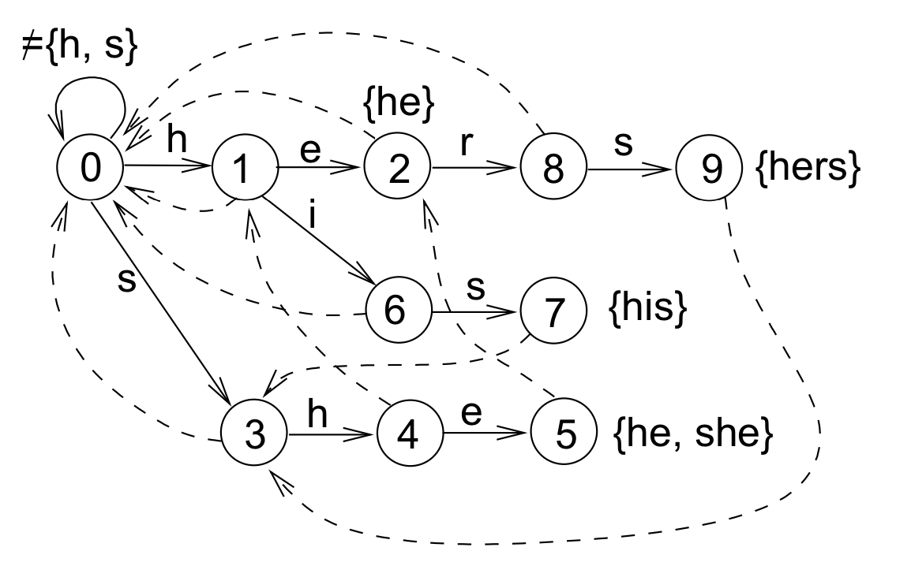

# Aho-Corasick Automaton

Primarily based on [these notes](http://www.cs.uku.fi/~kilpelai/BSA05/lectures/slides04.pdf).

Given a set of words (the dictionary) and an alphabet (sigma), this produces an automaton used to match any word in the dictionary against an input string. Each character in the input string must be in the alphabet.

I like to think of it as a mixture of [KMP failure function method](https://en.wikipedia.org/wiki/Knuth%E2%80%93Morris%E2%80%93Pratt_algorithm) and [DFA String matching](https://en.wikipedia.org/wiki/String_searching_algorithm#Finite_state_automaton_based_search), but now extended to a set of words rather than one specific word.

Failure functions now have the option to fail to a state across the tree, creating a cross-edge rather than only failing to previous states in the current word being matched.

Example below based on the dictionary: {he, his, hers, she}
Bold edges represent children (paths to follow when matching).
Dotted edges represent failure states (paths to follow when match fails).

